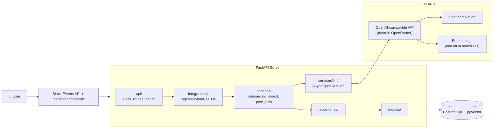

# Architecture

## High-level picture

`forest` runs as **one HTTP process** (Uvicorn) serving:

1. **FastAPI** health and readiness probes (`/healthz`, `/ready`).
2. **Slack Events API** webhook (`/slack/events`) for passive message ingest.
3. **Slack mention commands** (`@forest help`, `init`, `update`, `show`) via `app_mention` events.

## Layering rules

- **`forest/integrations/`**: **platform-neutral** Pydantic types. Adapters map native events here.
- **`forest/platforms/`**: SDK-specific code. Implements `slack/` using `slack-sdk`.
- **`forest/services/`**: business logic consuming DTOs + DB repositories.
- **`forest/repositories/`**: persistence helpers around SQLAlchemy sessions.
- **`forest/models/`**: ORM definitions; Alembic migrations track schema.

## Data model (conceptual)

- **`Workspace`**: one row per external workspace (Slack team), keyed by `(platform, platform_workspace_id)`. Tracks `is_initialized` after onboarding.
- **`FileNode`**: tree nodes (directories or files). Unique `(workspace_id, full_path)` for leaves and dirs used as paths. Optional `external_key` for dedup (URL + message id). File rows store `summary` and `embedding` (vector).

Virtual **root** is a directory row with `full_path="/"` per workspace.

## Ingest pipeline

1. Slack delivers a `message` event to `/slack/events`.
2. Handler verifies the signing secret, builds an `IngestPayload`, fires `process_ingest` via `asyncio.create_task`, and returns 200.
3. For each cue: **route** (chat completion, JSON), **ensure_path** for parent dirs, **embed** summary, **insert** file row (one transaction per cue).
4. Duplicate events are safe: the `(workspace_id, external_key)` unique constraint prevents duplicate file rows.

Routing failures fall back to `/Inbox` with a generic summary (logged).

## LLM boundary

All chat and embedding calls go through **`LLMService`**, using an **OpenAI-shaped** HTTP API (`AsyncOpenAI` + `base_url`). **Default:** **OpenRouter** (`LLM_BASE_URL` = `https://openrouter.ai/api/v1`). **Alternatively:** point **`LLM_BASE_URL`** at another OpenAI-compatible service (direct OpenAI, Azure OpenAI, Ollama, …). See **[LLM configuration](llm-configuration.md)**.

## Observability

Uses **stdlib `logging`** with structured `extra=` fields at important boundaries. Metrics and distributed tracing are deferred.
