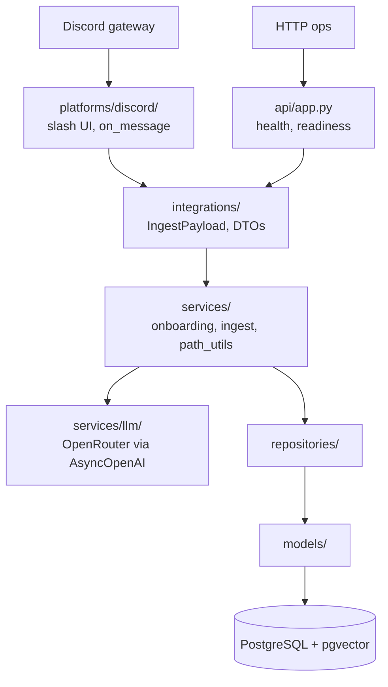

# Architecture

## High-level picture

Forest runs as **one OS process** that concurrently:

1. Hosts **FastAPI** on Uvicorn (`/healthz`, `/ready`).
2. Runs the **Discord** client (`discord.py`).

Both share **settings**, the **async SQLAlchemy engine**, and the bot-owned **ingest queue**.

## Layering rules

- **`forest/integrations/`**: **platform-neutral** Pydantic types (no `discord` imports). Adapters map native events here.
- **`forest/platforms/`**: SDK-specific code. MVP implements `discord/`; `slack/` is a stub for layout only.
- **`forest/services/`**: business logic consuming DTOs + DB repositories. Should not import Discord types (convention for MVP).
- **`forest/repositories/`**: persistence helpers around SQLAlchemy sessions.
- **`forest/models/`**: ORM definitions; Alembic migrations track schema.

## Data model (conceptual)

- **`Workspace`**: one row per external workspace (e.g. Discord guild), keyed by `(platform, platform_workspace_id)`. Tracks `is_initialized` after onboarding.
- **`FileNode`**: tree nodes (directories or files). Unique `(workspace_id, full_path)` for leaves and dirs used as paths. Optional `external_key` for dedup (URL + message id). File rows store `summary` and `embedding` (vector).

Virtual **root** is a directory row with `full_path="/"` per workspace.

## Ingest pipeline

1. Adapter builds `IngestPayload` (context lines, attachments, extracted URLs).
2. Payload is placed on a **bounded `asyncio.Queue`**.
3. A worker consumes jobs; a **per-guild semaphore** limits concurrent LLM/DB work.
4. For each cue: **route** (chat completion, JSON), **ensure_path** for parent dirs, **embed** summary, **insert** file row (one transaction per cue).

Routing failures fall back to `/Inbox` with a generic summary (logged).

## LLM boundary

All chat and embedding calls go through **`LLMService`**, configured for **OpenRouter** only (`base_url` + model ids). No first-party Anthropic/Google/OpenAI SDK paths as primary in MVP.

## Observability

MVP uses **stdlib `logging`** with structured `extra=` fields at important boundaries. Metrics and distributed tracing are deferred.
